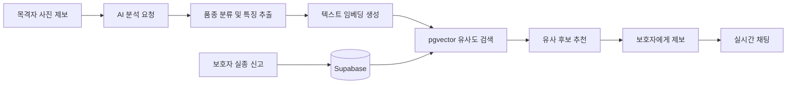
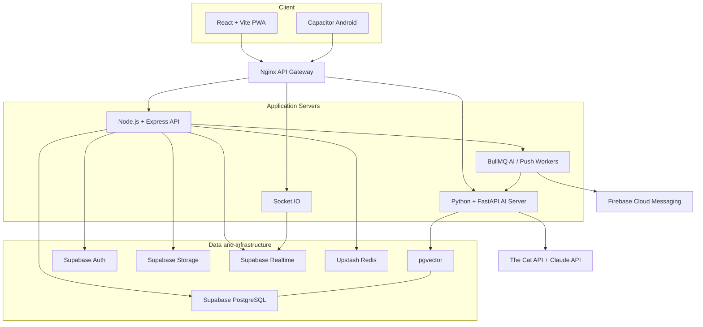

# Missing CAT

> 사진과 위치 정보를 바탕으로 실종 고양이와 제보를 연결하는 AI 기반 실종 반려동물 찾기 서비스

Missing CAT은 실종 신고를 지역 기반으로 공유하고, 목격자가 촬영한 고양이 사진을 기존 신고 데이터와 비교해 유사한 후보를 찾아주는 모바일 서비스입니다. AI가 제안한 후보를 확인한 뒤 보호자에게 제보를 보내고 실시간 채팅으로 추가 정보를 전달할 수 있습니다.

> AI 유사도는 탐색을 돕는 참고 정보이며, 동일 개체임을 확정하는 판정이 아닙니다.

## 주요 기능

| 기능 | 설명 |
| --- | --- |
| 실종 신고 | 위치, 사진, 반려동물 특징, 실종 시각, 사례금 정보를 단계별로 등록합니다. |
| 지역 기반 피드 | 지역별 신고를 최신순, 좋아요순, 댓글순으로 조회합니다. |
| 지도 탐색 | 좌표가 등록된 실종 사례를 Kakao Map 위에서 확인합니다. |
| AI 사진 매칭 | 목격 사진 3~5장을 분석해 품종과 특징을 추출하고 유사한 실종 사례를 추천합니다. |
| 제보와 채팅 | 매칭 후보의 보호자에게 제보를 전송하고 실시간 채팅을 시작합니다. |
| 커뮤니티 | 신고 상세 조회, 좋아요, 댓글을 통해 정보를 함께 갱신합니다. |
| 알림 | 채팅과 서비스 이벤트를 실시간 알림 및 모바일 푸시로 전달합니다. |
| 모바일 지원 | PWA와 Capacitor 기반 Android 앱으로 카메라, 위치, 푸시 기능을 사용합니다. |

## 서비스 흐름



1. 보호자가 고양이 사진과 실종 위치를 포함한 신고를 등록합니다.
2. 목격자가 발견한 고양이의 사진 3~5장을 업로드합니다.
3. AI 서버가 품종과 외형 특징을 분석하고 다국어 임베딩을 생성합니다.
4. Supabase pgvector에서 위치와 특징이 유사한 실종 사례를 검색합니다.
5. 목격자가 후보를 검토한 후 보호자에게 제보를 보내고 채팅으로 연결됩니다.

## 시스템 아키텍처



## 기술 스택

| 영역 | 기술 |
| --- | --- |
| Client | React 18, TypeScript, Vite, React Router, Zustand, Axios |
| Mobile / PWA | Capacitor 8, Android, Vite PWA, Camera, Geolocation, Push Notifications |
| Map | Kakao Maps API |
| Backend | Node.js 20, Express, Socket.IO, Swagger, Jest |
| AI | Python 3.11, FastAPI, Claude API, The Cat API, Sentence Transformers |
| Data | Supabase PostgreSQL, pgvector, Auth, Storage, Realtime |
| Queue / Cache | Upstash Redis, BullMQ |
| Infrastructure | Docker, Docker Compose, Nginx, PM2 |

AI 특징 문장은 `paraphrase-multilingual-mpnet-base-v2` 모델을 통해 벡터로 변환되며, 등록된 실종 사례의 벡터와 비교됩니다.

## 프로젝트 구조

```text
MissingCat/
├── Missing-Cat-Android-main/
│   └── Missing-Cat-Android-main/    # React PWA 및 Capacitor Android 앱
├── AI-Server-yw/
│   └── AI-Server-yw/
│       ├── server/                  # Express REST API, Socket.IO, 작업 큐
│       ├── ai_server/               # FastAPI 분석 서버 및 AI Worker
│       ├── supabase/                # DB 마이그레이션, 정책, 시드 데이터
│       ├── nginx/                   # API Gateway 설정
│       └── docker-compose.yml
└── frontUI-main/                    # IDE 프로젝트 설정 보관 디렉터리
```

## 로컬 실행

### 요구 사항

- Node.js 20 이상
- Python 3.11 이상
- npm
- Supabase 프로젝트
- Redis 또는 Upstash Redis
- Android 빌드 시 Android Studio와 JDK

AI 분석 기능을 사용하려면 The Cat API와 Anthropic API 키가 필요합니다. Kakao 지도, Google OAuth, 모바일 푸시 기능에는 각 서비스의 별도 설정이 필요합니다.

### 1. 백엔드 환경 설정

```powershell
cd AI-Server-yw\AI-Server-yw
Copy-Item .env.example server\.env
Copy-Item .env.example ai_server\.env
```

다음 값을 실제 개발 환경에 맞게 설정합니다.

```dotenv
# Express / Supabase
PORT=3000
CORS_ORIGIN=http://localhost:5173
SUPABASE_URL=
SUPABASE_ANON_KEY=
SUPABASE_SERVICE_ROLE_KEY=

# Queue / cache
UPSTASH_REDIS_URL=

# AI providers
AI_SERVER_URL=http://localhost:8000
ANTHROPIC_API_KEY=
CAT_API_KEY=

# Push notifications
FCM_PROJECT_ID=
FCM_V1_ACCESS_TOKEN=
```

Supabase SQL Editor 또는 CLI에서 `supabase/migrations`의 `001`부터 `014`까지 순서대로 적용하고, 필요하면 `supabase/seed.sql`을 실행합니다.

### 2. 서버 실행

각 터미널에서 다음 프로세스를 실행합니다.

```powershell
# Express API
cd AI-Server-yw\AI-Server-yw\server
npm install
npm run dev
```

```powershell
# FastAPI AI server
cd AI-Server-yw\AI-Server-yw\ai_server
python -m venv .venv
.\.venv\Scripts\Activate.ps1
pip install -r requirements.txt
uvicorn main:app --reload --port 8000
```

```powershell
# AI queue worker
cd AI-Server-yw\AI-Server-yw\ai_server
.\.venv\Scripts\Activate.ps1
python workers\ai_worker.py
```

Docker를 사용하는 경우 `server/.env`와 `ai_server/.env`를 준비한 후 다음 명령으로 세 프로세스를 실행할 수 있습니다.

```powershell
cd AI-Server-yw\AI-Server-yw
docker compose up --build
```

### 3. 클라이언트 실행

```powershell
cd Missing-Cat-Android-main\Missing-Cat-Android-main
Copy-Item .env.example .env
npm install
npm run dev
```

클라이언트 `.env`에는 사용하는 기능에 따라 다음 값도 설정합니다.

```dotenv
VITE_API_BASE_URL=http://localhost:3000/api
VITE_KAKAO_MAP_API_KEY=
VITE_SUPABASE_URL=
VITE_SUPABASE_ANON_KEY=
VITE_FIREBASE_API_KEY=
VITE_FIREBASE_AUTH_DOMAIN=
VITE_FIREBASE_PROJECT_ID=
VITE_FIREBASE_MESSAGING_SENDER_ID=
VITE_FIREBASE_APP_ID=
```

개발 서버는 기본적으로 `http://localhost:5173`에서 실행됩니다. `VITE_API_BASE_URL`을 생략하면 Vite 프록시가 `/api`, `/ai`, `/ws` 요청을 각각 로컬 서버로 전달합니다.

### Android 빌드

```powershell
cd Missing-Cat-Android-main\Missing-Cat-Android-main
npm run build
npx cap sync android
npx cap open android
```

## API 및 상태 확인

서버 실행 후 다음 주소를 사용할 수 있습니다.

| 주소 | 용도 |
| --- | --- |
| `http://localhost:3000/health` | Express API 상태 확인 |
| `http://localhost:3000/docs` | Swagger UI |
| `http://localhost:3000/docs/openapi.json` | OpenAPI 명세 |
| `http://localhost:8000/health` | FastAPI AI 서버 상태 확인 |
| `http://localhost:8000/docs` | FastAPI Swagger UI |

주요 API 영역은 인증, 사용자, 실종 신고, 댓글, 제보 분석, 채팅, 알림, 파일 업로드, 디바이스 토큰으로 구성됩니다.

## 테스트와 품질 검사

```powershell
# Express API smoke tests
cd AI-Server-yw\AI-Server-yw\server
npm test

# AI server tests
cd ..\ai_server
pytest

# Client lint and production build
cd ..\..\..\Missing-Cat-Android-main\Missing-Cat-Android-main
npm run lint
npm run build
```

## 라이선스

백엔드 및 AI 서버 코드는 [MIT License](AI-Server-yw/AI-Server-yw/LICENSE)를 따릅니다.
